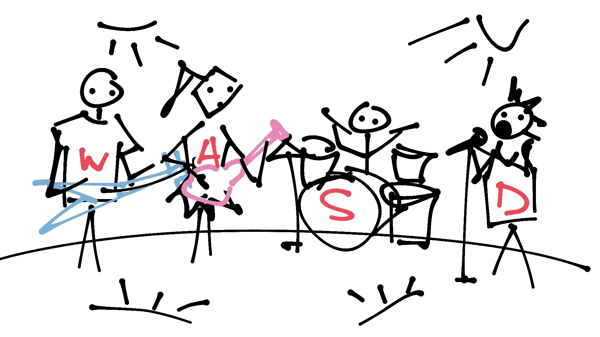

# iryna-lysenko-tp1 Simon Sings

Dans mon TP 1, je veux faire une façon du jeu Simon Says, mais avec un groupe de musique. Je veux que ce soit un jeu de mémoire, où chaque membre du groupe (basse, guitare électrique, batterie, chant) va jouer une note (petite animation et effet sonore) et le joueur doit appuyer sur les touches W, A, S, D conformément sur les t-shirts des musiciens et il gagne en mémorisant une chaîne de notes la plus longue. Les notes vont être jouées en ordre random. C'est une idée générale de mon projet, mais j'ai 3 options de qui vont être les membres du groupe pour les cas si une ou l'autre option ne sera pas possible.

## Option 1 (la principale)
Mon ami a un groupe de musique imaginaire avec les personnages dessinés et je voudrais qu'ils deviennent des personnages du jeu. Pour les effets sonores, je vais trouver sur les sites web les sons libre droit des instruments de musique. Mon ami est au courant que je veux utiliser ses personnages et il est d'accord de les dessiner pour moi. Je sais que c'est un projet individuel, donc mon ami ne participera pas au codage au moins parce qu'il ne sait pas coder, alors j'espère que cette option est possible, sinon j'en ai 2 autres.

## Option 2
Dans ma ville de résidence, Sorel-Tracy, il y a un groupe de musique As You Wish, membres de laquelle je connais en personne et je peux leur parler s'ils vont être d'accord d'être les personnages de mon projet collégial et je suis pas mal sûre qu'ils vont être d'accord. Dans ce cas, je vais soit prendre les photos des membres ou les dessiner par moi-même. Pour les effets sonores, je vais sois aussi les trouver sur les sites web, sois je vais demander des membres de jouer une note pour moi.

## Option 3
Je vais tout simplement trouver les imagés des metalheads et les effets sonores sur les sites web de médias libre droit.

## Option 4 (la plus plate)
J'oublie mon idée du groupe de musique et je fais une copie littérale de Simon Says en forme de cercle avec 4 petits blocs de couleurs.
